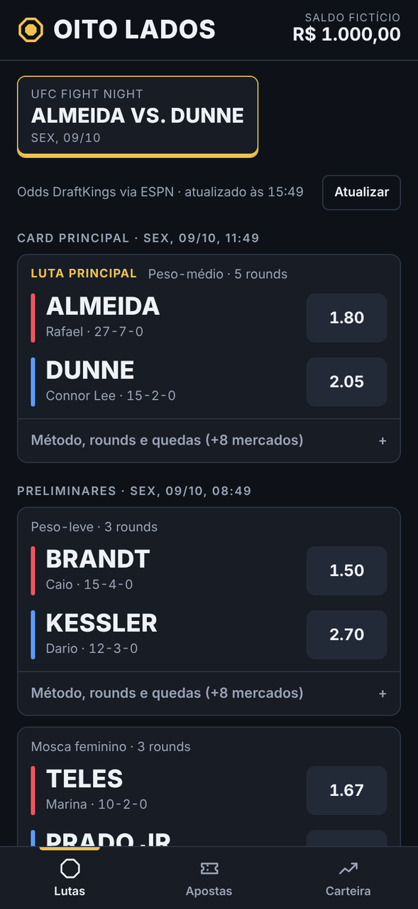
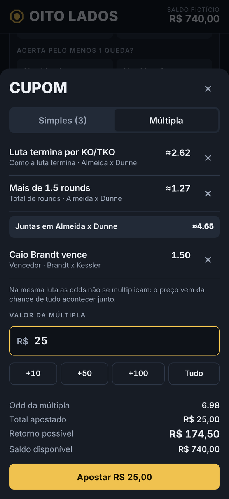
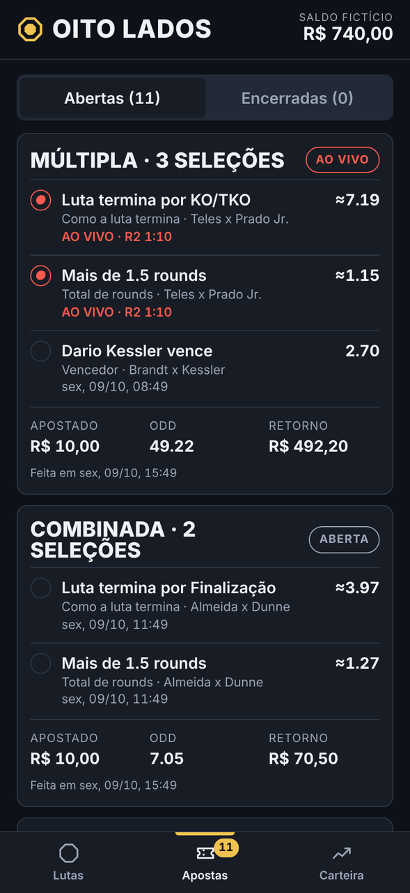
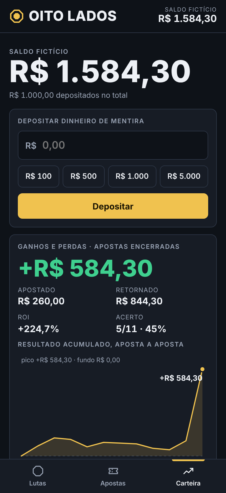

# Oito Lados

> Brinque sem ter medo financeiro.

[](https://github.com/lucasmagalhaees/oito-lados/actions/workflows/ci.yml)
[](LICENSE)

No ar em **https://oito-lados.vercel.app**.

Simulador de apostas de UFC com **dinheiro fictício** e **odds reais**. Você deposita quanto quiser de mentira, aposta no card da semana e o app acompanha as lutas ao vivo e fecha as apostas com o resultado oficial. Nenhum centavo de verdade entra ou sai.

| Lutas | Cupom | Ao vivo | Carteira |
|---|---|---|---|
|  |  |  |  |

As telas acima vêm do teste automatizado, com lutadores e resultados inventados.

## O que faz

- **Saldo fictício:** depósitos ilimitados, saldo sempre derivado do histórico.
- **Mercados:** vencedor, método (KO/TKO, finalização, decisão), vai até a decisão, total de rounds, round em que acaba, vencedor e round, quedas na luta e por lutador.
- **Simples, múltipla e combinada:** a combinada na mesma luta é precificada pela chance de tudo acontecer junto, não pela multiplicação das odds. Combinações impossíveis ou redundantes são recusadas.
- **Ao vivo:** round, relógio e quedas das lutas em andamento. A aposta fecha sozinha quando sai o resultado oficial.
- **Cashout:** devolve o valor integral enquanto nenhuma luta da aposta foi decidida. Se parte da múltipla já bateu e o resto ainda não começou, oferece um valor para encerrar, calculado pelas odds de agora. Com luta em andamento, cashout e apostas ficam congelados.
- **Repetir aposta:** um toque devolve as mesmas seleções e o mesmo valor ao cupom.
- **Copiar aposta:** cola o texto de um palpite ou escolhe o print de uma aposta; o app acha a luta e a seleção e monta o cupom com a odd de agora. Se o original fala em unidades, copia as unidades. Se traz dinheiro, você escolhe: mesmo valor ou mesma stake. A imagem é lida no próprio aparelho.
- **Unidade:** uma porcentagem da banca (10% por padrão, ajustável). Nas configurações você escolhe se o cupom pede o valor em dinheiro ou em unidades, e a Carteira mostra o resultado em unidades.
- **Leitura rápida:** mais e menos de uma linha aparecem como + e −, com cores próprias, e cada opção ligada a um lutador leva a cor do canto dele. Com os mercados abertos, uma legenda presa na tela lembra quem é o vermelho e quem é o azul.
- **Tema:** automático, claro ou escuro.
- **Abre sem internet:** o app fica guardado no aparelho e abre na hora, com os últimos dados que carregou. Quando sai uma versão nova, ele avisa e troca com um toque.
- **Valores e moeda:** campos com máscara de milhares; banca em real, dólar ou euro. A moeda é escolhida no cartão de depósito, e passar para outra moeda converte a banca inteira pela cotação do dia, com ou sem depósito.
- **Ganhos e perdas:** lucro ou prejuízo, ROI, taxa de acerto, gráfico acumulado e quebra por mercado e por evento.

## Como funciona

É uma página estática, sem backend. O navegador consulta a API pública da ESPN para montar o card, ler as odds e acompanhar status, resultado e estatísticas.

O código é TypeScript em módulos (`src/`). O build do Vite gera `dist/index.html`, a página inteira num arquivo, com script e estilo dentro, e `dist/sw.js`, o service worker que guarda essa página no aparelho. É isso que os testes usam e o que vai para o ar.

| | De onde vem |
|---|---|
| Vencedor, método por lutador, vai até a decisão, linha principal de rounds | Odds publicadas pela casa (hoje DraftKings), via ESPN |
| Quedas, round exato, linhas alternativas de rounds, combinadas | Estimadas por um modelo próprio a partir das odds reais e do histórico dos lutadores. Aparecem com `≈` |
| Liquidação | Sempre o resultado oficial: vencedor, método, round, tempo e quedas |
| Cotação para trocar a moeda da banca | Frankfurter (`api.frankfurter.dev`), consultado só quando um depósito muda a moeda |

Saldo e apostas ficam no `localStorage` do aparelho. A Carteira tem backup e restauração por texto.

A especificação completa (endpoints, formato dos dados, modelo de preço e regras de liquidação) está em [`CLAUDE.md`](CLAUDE.md).

## Rodando local

Precisa de Node 22 ou mais novo.

```bash
npm ci
npm run dev      # servidor de desenvolvimento; abra o endereço que ele mostrar
npm run build    # gera dist/index.html e dist/sw.js, o que é publicado
```

## Testes

```bash
npm ci                      # Vite e TypeScript
pip install -r tests/requirements.txt
playwright install chromium
npm ci --prefix tests       # arquivos do leitor de imagem usados no teste
scripts/verify.sh           # confere os tipos, faz o build e roda tudo contra a página gerada
```

| Teste | O que confere |
|---|---|
| `tests/unit.py` | Conversão de odds, modelo de preço, combinadas e cada regra de liquidação |
| `tests/contract.py` | Os leitores da ESPN e do serviço de câmbio contra respostas reais gravadas em `tests/fixtures/` |
| `tests/docs_check.py` | A documentação contra o código: links, arquivos, constantes, chaves |
| `tests/e2e.py` | O fluxo inteiro pela interface, com a ESPN simulada, do pré-luta ao resultado |
| `tests/pwa.py` | O service worker, com a página servida por um servidor local: abrir sem conexão, aviso de versão nova e troca pelo botão |
| `tests/cov.py` | Cobertura de código, medida pelo navegador durante os testes. O `verify.sh` falha abaixo de 95% das funções ou 90% do código |
| `tests/contract_live.py` | A API real da ESPN e o serviço de câmbio. Roda toda semana no GitHub Actions e avisa se o formato mudar |
| `scripts/check_production.py` | Depois de cada merge, se a produção está no commit da `main` e continua nele |

Tudo, menos os dois últimos, roda no GitHub Actions em cada PR e em cada push na `main`. Se mesclar vários PRs, faça um por vez e espere o deploy: merges em sequência já deixaram a produção numa versão antiga.

## Desenvolvimento com IA

O projeto é mantido com ajuda de IA e tem um harness para ela não afirmar o que não verificou: um comando único de verificação, contrato com respostas reais da API, documentação conferida contra o código, um hook que impede o Claude Code de encerrar a tarefa com checagem falhando, e um registro do que foi e do que não foi verificado. As regras estão em [`CLAUDE.md`](CLAUDE.md); as decisões, em [`docs/decisoes.md`](docs/decisoes.md); o registro, em [`docs/verificacao.md`](docs/verificacao.md).

## Fluxo e publicação

1. Branch novo a partir da `main`.
2. PR para a `main`. O CI roda os testes e a Vercel publica uma prévia do PR.
3. Merge na `main` publica em produção.

Configuração, uma vez só:

- **Vercel:** importar este repositório em um projeto novo. O `vercel.json` já diz como construir (`npm ci`, `npm run build`, publicar `dist/`). A partir daí o deploy é automático.
- **GitHub:** em Settings → Branches, proteger a `main` exigindo PR e os checks `checks`, `e2e (dark)` e `e2e (light)`. Assim só código testado chega à produção.

No iPhone: abra a URL de produção no Safari, toque em Compartilhar e em Adicionar à Tela de Início.

## Estrutura

```
index.html                           esqueleto da página, entrada do build
src/core/                            lógica pura: odds, leitores da ESPN, preço, liquidação, cashout
src/app/                             a página: estado, rede, telas e eventos
src/main.ts                          ponto de entrada
src/sw.js                            service worker: guarda o app no aparelho
package.json                         Vite e TypeScript, em versões exatas
vite.config.js                       build: a página num arquivo só, mais o service worker
tsconfig.json                        TypeScript em modo strict
vercel.json                          como a Vercel constrói e publica
scripts/verify.sh                    comando único de verificação
scripts/check_production.py          confere a produção contra a main
tests/unit.py                        testes do núcleo (preço e liquidação)
tests/contract.py                    leitores da ESPN contra respostas reais gravadas
tests/contract_live.py               conferência da API real da ESPN
tests/docs_check.py                  documentação conferida contra o código
tests/e2e.py                         teste ponta a ponta
tests/mock_espn.py                   ESPN simulada, com lutadores fictícios
tests/pwa.py                         abrir sem conexão e trocar de versão
tests/cov.py                         cobertura de código medida pelo navegador
tests/package.json                   cópias locais do leitor de imagem para o teste
tests/fixtures/espn/                 respostas reais da ESPN, reduzidas
tests/fixtures/fx/                   resposta real do serviço de câmbio
docs/decisoes.md                     o que foi decidido e por quê
docs/verificacao.md                  o que foi verificado e o que não foi
docs/escala.md                       caminho de escala
docs/screenshots/                    telas usadas neste README
.github/workflows/ci.yml             testes em cada PR e push na main
.github/workflows/espn-contract.yml  conferência semanal da API real
.github/workflows/producao.yml       conferência da produção depois de cada merge
.claude/settings.json                hook de parada do Claude Code
CLAUDE.md                            especificação e regras do projeto
```

## Escopo

É um MVP para um usuário, simples de propósito. O que muda se precisar crescer está em [`docs/escala.md`](docs/escala.md).

## Limites conhecidos

- A API da ESPN é pública, mas não é oficial nem documentada, e pode mudar sem aviso.
- Só atualiza com o app aberto. Ao reabrir, ele busca os resultados e liquida o que ficou pendente.
- Sem internet dá para abrir e ver lutas, apostas e carteira como estavam. Apostar, fazer cashout e trocar de moeda exigem conexão.
- Depois de uma publicação, o aparelho continua na versão anterior até você tocar em "Atualizar agora".
- As odds travam quando a luta começa. Não há aposta ao vivo.
- Os dados ficam em um aparelho só.

## Aviso

Projeto de entretenimento. Não aceita, movimenta nem paga dinheiro real, e não é uma casa de apostas. Não tem vínculo com UFC, ESPN ou DraftKings; nomes e marcas pertencem aos respectivos donos. As odds são exibidas apenas como referência para a simulação.

## Licença

[MIT](LICENSE) © 2026 Lucas Magalhães
